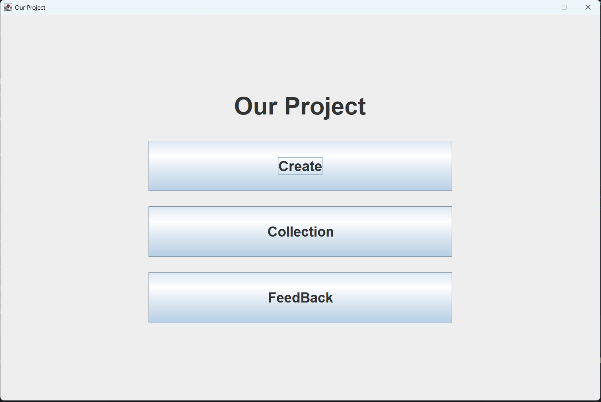
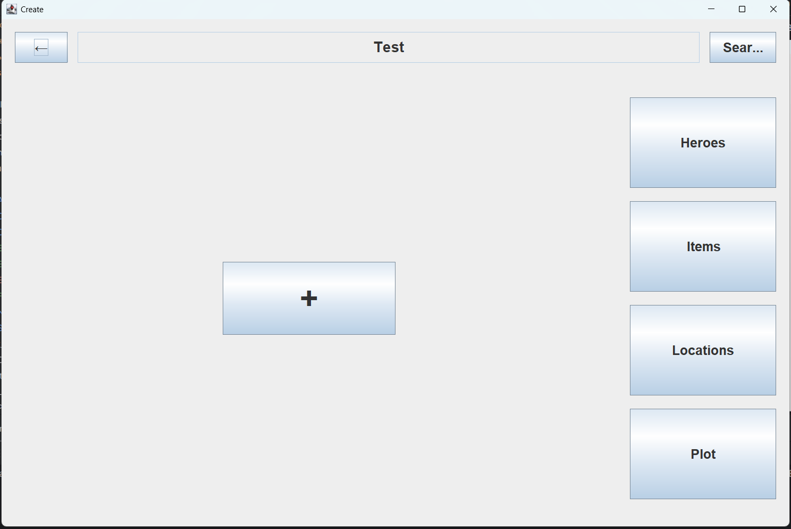
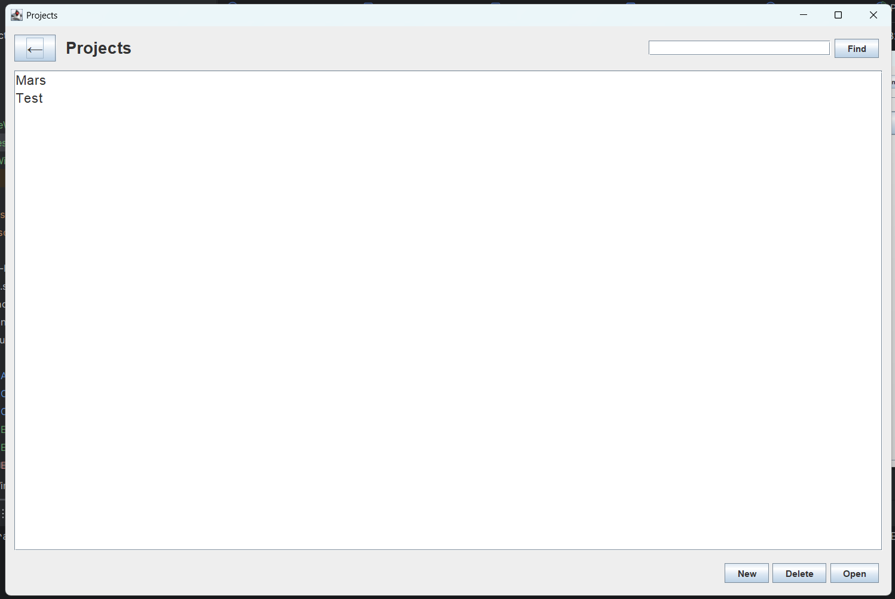
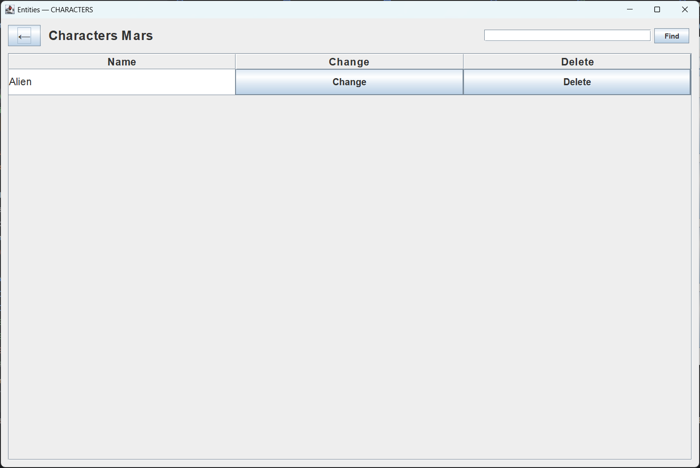
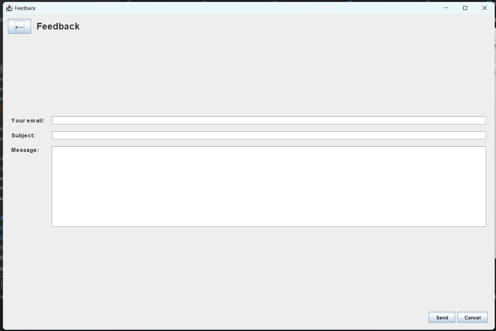
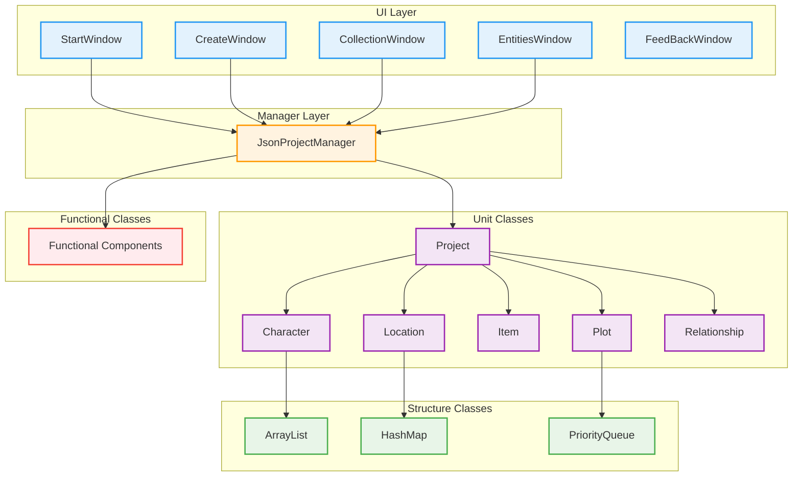

# 📚 SiakodProject - Система управления лором и сюжетом

<div align="center">
  
  <p><em>Главное окно приложения SiakodProject</em></p>
</div>

[](https://openjdk.org/)
[](https://openjfx.io/)
[](https://www.json.org/)
[](https://choosealicense.com/licenses/mit/)

## 🎯 О проекте

**SiakodProject** - это мощное Java-приложение для создания и управления лором, сюжетными линиями и персонажами игр, книг и фильмов. Система позволяет писателям, сценаристам и геймдизайнерам структурированно организовать творческий процесс.

### ✨ Ключевые возможности

🎭 **Управление персонажами** - создание детальных профилей с характеристиками и историей  
🏛️ **База локаций** - описание мест действия с их особенностями и связями  
📦 **Система предметов** - каталог важных объектов мира  
🌐 **Сеть отношений** - визуализация связей между персонажами  
📖 **Сюжетные линии** - структурирование и развитие повествования  
💾 **JSON сохранение** - надежное хранение проектов в универсальном формате

## 🖥️ Интерфейс приложения

### Создание нового проекта
<div align="center">
  
  <p><em>Окно создания нового проекта</em></p>
</div>

Интуитивный интерфейс создания проекта позволяет быстро начать работу над новой историей.

### Управление коллекцией проектов
<div align="center">
  
  <p><em>Коллекция проектов с возможностью поиска и сортировки</em></p>
</div>

Централизованное управление всеми вашими творческими проектами с удобной навигацией.

### Работа с сущностями
<div align="center">
  
  <p><em>Интерфейс управления персонажами, локациями и предметами</em></p>
</div>

Детальное редактирование всех элементов вашего мира в одном окне.

### Обратная связь
<div align="center">
  
  <p><em>Окно обратной связи для улучшения приложения</em></p>
</div>

Встроенная система обратной связи для постоянного улучшения функционала.

## 🏗️ Архитектура проекта



## 📁 Структура проекта

```
SiakodProject/
├── src/ru/vsu/sc/siakod25/g11/theme_6/
│   ├── ui/                     # Пользовательский интерфейс
│   │   ├── StartWindow.java
│   │   ├── CreateWindow.java
│   │   ├── CollectionWindow.java
│   │   ├── EntitiesWindow.java
│   │   └── FeedBackWindow.java
│   ├── manager/                # Менеджеры системы
│   │   └── JsonProjectManager.java
│   ├── unit_classes/           # Основные сущности
│   │   ├── Project.java
│   │   ├── Character.java
│   │   ├── Location.java
│   │   ├── Item.java
│   │   ├── Plot.java
│   │   └── Relationship.java
│   ├── structure_classes/      # Структуры данных
│   │   ├── ArrayList.java
│   │   ├── HashMap.java
│   │   └── PriorityQueue.java
│   └── functional_classes/     # Функциональные компоненты
├── docs/                       # Документация и скриншоты
└── projects/                   # Сохраненные проекты (JSON)
```

## 🎮 Основные сущности

### 👤 Character (Персонаж)
```java
public class Character {
    private String name;        // Имя персонажа
    private String description; // Описание и характеристики
    private String backstory;   // Предыстория
    private List<String> traits; // Особенности характера
}
```

### 🏛️ Location (Локация)
```java
public class Location {
    private String name;        // Название места
    private String description; // Детальное описание
    private String atmosphere;  // Атмосфера и настроение
}
```

### 📦 Item (Предмет)
```java
public class Item {
    private String name;        // Название предмета
    private String description; // Описание и свойства
    private String significance; // Значимость в сюжете
}
```

### 🌐 Relationship (Отношения)
```java
public class Relationship {
    private String character1;  // Первый персонаж
    private String character2;  // Второй персонаж
    private String type;        // Тип отношений
    private String description; // Детали взаимоотношений
}
```

## 🚀 Быстрый старт

### Требования
- **Java 11** или выше
- **JavaFX** (включен в современные JDK)
- **IntelliJ IDEA** (рекомендуется)

### Установка и запуск

1. **Клонирование репозитория**
```bash
git clone https://github.com/mama-lama/SiakodProject.git
cd SiakodProject
```

2. **Открытие в IDE**
```bash
# Для IntelliJ IDEA
idea .
```

3. **Настройка проекта**
- Убедитесь, что используется Java 11+
- Настройте JavaFX в конфигурации запуска
- Добавьте VM options: `--module-path /path/to/javafx/lib --add-modules javafx.controls,javafx.fxml`

4. **Запуск**
- Найдите класс с методом `main()`
- Запустите приложение

## 💡 Использование

### Создание нового проекта
1. Запустите приложение
2. Нажмите "Создать новый проект"
3. Введите название и описание
4. Начните добавлять персонажей и локации

### Управление сущностями
- **Персонажи**: Добавляйте детальные описания, черты характера, предысторию
- **Локации**: Создавайте атмосферные места действия
- **Предметы**: Каталогизируйте важные объекты вашего мира
- **Отношения**: Визуализируйте связи между персонажами

### Сохранение и загрузка
- Проекты автоматически сохраняются в формате JSON
- Удобная система загрузки существующих проектов
- Экспорт данных для использования в других приложениях

## 🛠️ Технические особенности

### Паттерны проектирования
- **MVC** - разделение логики, данных и представления
- **Manager** - централизованное управление проектами
- **Factory** - создание объектов различных типов
- **Observer** - обновление интерфейса при изменении данных

### Структуры данных
- **Собственная ArrayList** - динамические массивы для коллекций
- **HashMap** - быстрый поиск по ключам
- **PriorityQueue** - приоритетная обработка событий

### Персистентность
- **JSON сериализация** - надежное сохранение данных
- **Файловая система** - организация проектов в папки
- **Автосохранение** - защита от потери данных

## 👥 Команда разработки

- **[@mama-lama](https://github.com/mama-lama)** - Ведущий разработчик, UI/UX, архитектура
- **[@MoonBunny70](https://github.com/MoonBunny70)** - Backend разработчик, структуры данных

## 📈 Развитие проекта

### ✅ Реализовано
- Базовая архитектура приложения
- Пользовательский интерфейс
- Система управления проектами
- JSON сериализация
- Основные сущности (Персонажи, Локации, Предметы)

### 🔄 В разработке
- Расширенная система отношений
- Визуализация сюжетных линий
- Экспорт в различные форматы
- Система тегов и категорий

### 🎯 Планы
- Коллаборативная работа
- Интеграция с внешними API
- Мобильная версия
- Облачная синхронизация

## 🤝 Вклад в проект

Мы приветствуем вклад в развитие проекта! Если вы хотите участвовать:

1. **Fork** репозитория
2. Создайте **feature branch** (`git checkout -b feature/AmazingFeature`)
3. **Commit** изменения (`git commit -m 'Add some AmazingFeature'`)
4. **Push** в branch (`git push origin feature/AmazingFeature`)
5. Откройте **Pull Request**

### 📋 Issues и предложения
- Сообщения об ошибках
- Предложения новых функций
- Улучшения интерфейса
- Оптимизация производительности

## 📄 Лицензия

Проект распространяется под лицензией **MIT**. Подробности в файле [LICENSE](LICENSE).

## 📞 Контакты

**Ксения Ширяева** - [@mama-lama](https://github.com/mama-lama)

**Ссылка на проект**: [https://github.com/mama-lama/SiakodProject](https://github.com/mama-lama/SiakodProject)

---

<div align="center">
  <p><strong>Создавайте удивительные истории с SiakodProject! 📚✨</strong></p>
  <p><em>Превратите хаос идей в структурированный творческий процесс</em></p>
</div>